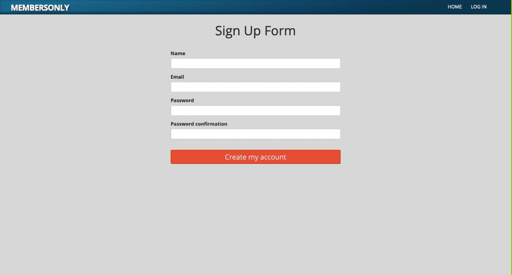
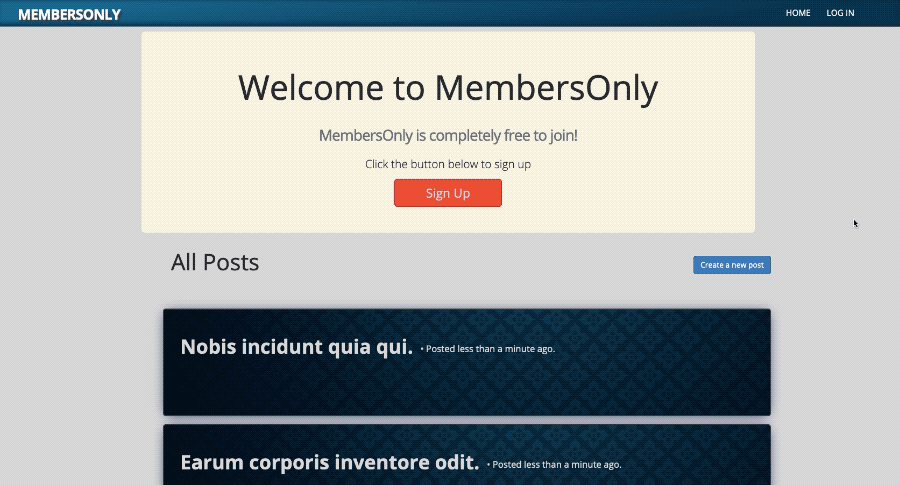

# 🔐 MembersOnly - Rolling Our Own Authentication

This project is part of a series of projects to be completed by students of [Microverse](https://www.microverse.org/).

In this project, we build a simple, exclusive social media type site where only members (those logged in) can create posts and see the users that created them. However for users that are not signed in or do not have an account, no post creation is possible and the authors of posts do not appear.

***********

## 🎥 Previews

> The Home page (post index) and the signing in process, redirecting back to the currently signed in user's profile page.

******

> Strong params are enabled site-wide and validations here prevent the user from attempting a sign-in with an incorrect email address.

*******

> Different content is served to the user depending on their authenticated status. Users who are signed in are able to create posts and see who made them. Those that aren't can only read posts, without seeing the authors.

******

> Before filters in action - Users are required to sign in before attempting to create a post. Flash messages notify the user of successful (and unsuccessful) actions.

*******

## 🎯 The Project Brief

The specifications and the guide to the project can be found The Odin Project's ['Project 2: Members Only!'](https://www.theodinproject.com/courses/ruby-on-rails/lessons/authentication) page.

This project focuses heavily on authentication in web apps. Specifically, in this project we are given the task to create our own authentication system versus using pre-existing authentication solutions such as ['Devise'](https://github.com/heartcombo/devise). This proves to be an invaluable lesson in understanding exactly how authentication systems work under the hood.

The authentication systems implemented into this project includes:
  - User authentication - Password encryption and password digest storage to avoid storing raw user passwords
  - Cookies - Session and remember me cookies for perpetuation of user authentication
  - Before filters preventing unauthorised users from performing higher level actions like seeing who created which posts

Furthermore, the use of cookies allow us to dynamically serve different content (and links) to the user depending on if they have been authenticated (signed in) or not.

## 🛠️ Technologies & Languages Used

- Ruby 2.6.5
- Ruby on Rails 6.0.2.1
- Bootstrap 4.3.1
- Rubocop 0.79.0
- Stickler CI

## 🔰 Setup & Usage

### Setup
In order to get this webpage up and running, you may have to do a little set up first.
  1. Make sure you have both ['Ruby'](https://www.ruby-lang.org/en/documentation/installation/) and Ruby on Rails (['Mac'](https://gorails.com/setup/osx/10.15-catalina) • ['Linux'](https://gorails.com/setup/ubuntu/19.10) • ['Windows'](https://gorails.com/setup/windows/10)) installed.
  2. Download this repo!
  3. `cd` into the root directory of wherever you download this repo. ['What does 'cd' mean?'](https://www.macworld.com/article/2042378/master-the-command-line-navigating-files-and-folders.html)
  4. In your terminal window, enter `rails server` to start the server.
  5. Now navigate to ['localhost:4000'](localhost:4000) in your browser to start playing with the webpage!

## 🕺🏽 Contributions, Issues & Forking

If you have any issues setting up the project or you come across any unintended bugs or problems, please do submit an issue to the [Members-Only-Authentication](https://github.com/Rhelli/Members-Only-Authentication/issues) page.

If you want to make your own changes, modifications or improvements to our project, go ahead and Fork it!
1. [Fork it](https://github.com/Rhelli/Members-Only-Authentication/fork)
2. Create your working branch (git checkout -b [choose-a-name])
3. Commit your changes (git commit -am 'what this commit will fix/add/improve')
4. Push to the branch (git push origin [chosen-name])
5. Create a new Pull Request

## 👨🏽‍💻 💂🏽‍♂️ Creators

Qoosim AbdulGhaniyy - [Github](https://github.com/Qoosim)

Rory Hellier - [GitHub](https://github.com/Rhelli)

## 🎁 Show Your Support

Give a ⭐️ if you like this project!